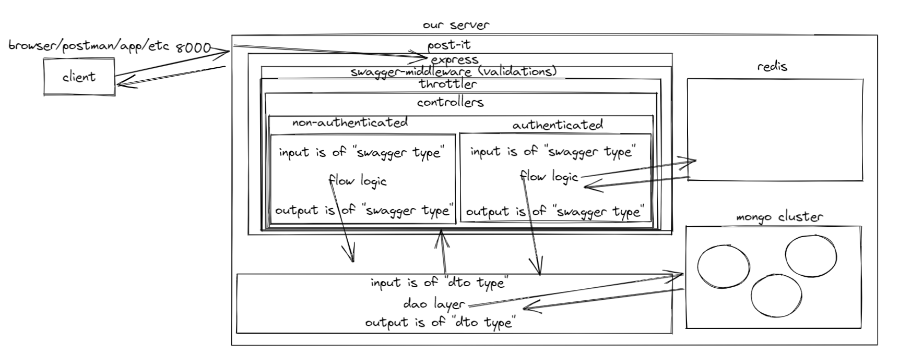

Creating a sample node service using "Express" as the rest layer,
the work was done in "API 1st" approach, meaning i have defined a swagger and later generated code from it.
Project is split into 2 main services:

1. user - responsible for registering and authentication (jwt)
2. post - post board

I have chosen functional programming with TDD as a guideline for this project, writing every function as a "Standalone" defensive component.
The code is split into layers which allow an easy switch between different technologies.

This project enhanced my skills with:

1. architecture
2. rest & swagger
3. defensive - throttle, input validations
4. tdd - mocking redis/mongo
5. mongo
6. docker

